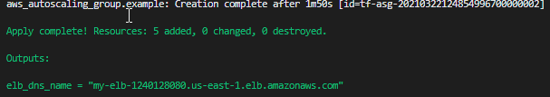

# Deploying an Autoscaled Cluster of EC2 instances Running a Spring Boot Application using Terraform

In this exercise, you will see how Terraform can be used to deploy an autoscaled cluster of instances that are behind a load balancer.

## Solution
The exercise involves creating three terraform files. Solutions to these files can be found in the same directory as this Markdown file in Github.

## Prerequisites
The machine you are on will need Terraform already installed. If you are on one of our virtual machines, this will already have been set up.

To complete this exercise, you must be using a machine that already has access to AWS resources through the AWS CLI. This means that you have already set up your AWS CLI environment using `aws configure`.

If you have never run `aws configure` on your machine before, then complete the following steps:

1. At a terminal, run the following command:

```
aws configure
```

2. When prompted for the *access key*, enter the value provided by your instructor.
3. When prompted for the *secret key*, enter the value provided by your instructor.
4. When prompted for the *region*, enter `us-east-1` unless told otherwise by your instructor.
5. When prompted for the output format, enter `json`.

That will now have configured your AWS command line tool to use the permissions assigned to your user, which is used by Terraform when you run Terraform commands at the terminal.

## Part 1 Set up the required Terraform Variables

1. Create a new folder on your machine where you wish to put your exercise. A name like `autoscale-terraform-example` for example.

Terraform projects typically contain a number of standard files such as:

+ main.tf
+ variables.tf
+ outputs.tf

The `main.tf` file is where you set up your resources, the `variables.tf` file is where you configure any parameters that could be changed when running the deployment, such as instance size, and `outputs.tf` which specifies any values that are output when the deployment has been completed, such as the URL of the load balancer of the running application.

2. Open your new folder in your preferred IDE, and in your new folder, create a file called `variables.tf`.

```
If you are using VisualStudio Code, you might want to install the Terraform extension. This will give you intellisense and color coding on your files.
```


Variables have the following basic structure:

```
variable "region" {
 description = "AWS region for hosting our your network"
 default = "us-east-1"
}
```

In the structure above, we are creating a variable with the name `region` and giving it a default value of `us-east-1`. The default value will be used if a value is not provided when your run the template. 

There is also a description so anyone using this Terraform configuration knows that the variable is for.

3. Add the region variable as defined in the structure above, to your `variables.tf` file.

4. Using the provided structure as a guide, now add the following additional variables. 

| Variable | Default value | Description |
---|---|---
| instance_count | 1 | Initial number of instances in the autoscaling group |
| minimum_size | 1 | The minimum number of instances in the autoscaling group |
| maximum_size | 1 | The maximum number of instances in the autoscaling group |
| key_pair | ExampleKeyPair | The name of the keypair to use for SSH access |

5. Save your `variables.tf` file.

You will now see how these variables are used to create the required infrastructure.

A solution `variables.tf` file can also be viewed here:

[variables.tf](variables.tf)

## Part 2 Specify the Region, CLI Profile, and AZs 

A `main.tf` file in a Terraform project where you create your required resources. In this next part of the exercise, you will create that file, and edit it to specify the required resources. The architecture of what we are creating is a load balancer with an autoscaled cluster of EC2 instances. The deployment will be into the default VPC.

1. In your project folder, create a new file called `main.tf`.

2. Terraform can be used to deploy infrastructure to Azure, AWS, Docker and others, so first we must specify that this is an AWS deployment, so add the following entry:

```
terraform {
  required_providers {
    aws = {
      source  = "hashicorp/aws"
      version = "~> 3.27"
    }
  }
}
```
The version of the AWS provider is specified so it doesn't just get the latest version which might break our template. 

We must now specify the AWS CLI profile to use. The AWS CLI supports multiple profiles to facilitate working with multiple accounts. We are only using one account and the default profile is simply called `default`. 

We also need to specify the region to use. Now the region was specified in our `variables.tf` file. 

1. To specify the region and set the profile, add the following block to your main.tf file.

```
provider "aws" {
  profile = "default"
  region  = var.region
}
```

Note the use of the `var` namespace. This gives us access to the variables set up in `variables.tf`. 

Next we will sort out the AMI to use. Our application is a Java application and we plan to use the latest Amazon Linux 2 AMI, but how can we know what its image ID is? Terraform provides a feature to enable us to access this. 

4. Add the following entry:

```
data "aws_ami" "amazon-linux-2" {
  most_recent = true
  owners      = ["amazon"]
  filter {
    name   = "name"
    values = ["amzn2-ami-hvm*"]
  }
}
```
These data blocks define what Terraform refers to as *Data sources*. Essentially, they allow us to access information that is outside of Terraform so we can use it in our template. In this example, we are accessing the AMI list from Amazon for the Amazon Linux, and we are just retrieving the latest version.


We now need to specify the availability zones to deploy to. If we are deploying to our own VPC then we must specify subnets, but when using the Default VPC, we can simply use the AZ names. However, if we are going to refer to AZ names, they are different for every region, so we need to access them as another piece of data from a Data Source. 

5. To set the AZ names, add the following block:

```
data "aws_availability_zones" "all" {
  state = "available"
}
```

## Part 3 Create the Resources

We are now ready to define our resources. We will need to configure the following

+ Elastic Load Balancer
+ Launch Configuration
+ Security group for the ELB
+ Security group for the instances

1. To define the Launch Configuration, add the following to your `main.tf` file:

```
resource "aws_launch_configuration" "my_launch_config" {
  image_id               = data.aws_ami.amazon-linux-2.image_id
  instance_type          = "t2.micro"
  security_groups        = [aws_security_group.instance-sg.id]
  key_name               = var.key_name
  user_data = <<-EOF
              #!/bin/bash
              yum update -y
              yum -y install java-1.8.0
              cd /home/ec2-user
              wget http://training.conygre.com/compactdiscapp.jar
              nohup java -jar compactdiscapp.jar > ec2dep.log
              EOF
  lifecycle {
    create_before_destroy = true
  }
}
```
Note the following.
* The image ID is taken from the Amazon Linux data. Note the way it is accessed via the `data` namespace.
* the security groups are an array, so we place [] brackets around the values to make them an array. We are actually just referring to a security group that we are going to create in a later section.
* The key pair file is using the variables through the `var` namespace.
* The userdata is an AWS specific feature where you provide a shell script or Powershell script that runs on first boot. It is used to configure the machine. In the example, it installs the latest patches, installs the JDK, gets the application, and finally launches it.
* The create_before_destroy does what it sounds like, and if you need to replace the VM with a new one, it will create the new one before destroying the old one.

2. To create the autoscaling group, add the following:

```
resource "aws_autoscaling_group" "example" {
  launch_configuration = aws_launch_configuration.my_launch_config.id
  min_size = var.minimum_size
  max_size = var.maximum_size
  load_balancers = [aws_elb.my-elb.name]
  availability_zones = data.aws_availability_zones.all.names
  health_check_type = "ELB"
  tag {
    key = "Name"
    value = "My Terraform Deployment"
    propagate_at_launch = true
  }
}
```
Note here that we are using the availability zones from our earlier section and also the launch configuration is set to use the one we just created.

3. Now copy in the following section. This is the configuration for the two security groups. One for the load balancer and one for the instances:

```
resource "aws_security_group" "elb-sg" {
  name = "elb-sg"
  egress {
    from_port = 0
    to_port = 0
    protocol = "-1"
    cidr_blocks = ["0.0.0.0/0"]
  }
  ingress {
    from_port = 80
    to_port = 80
    protocol = "tcp"
    cidr_blocks = ["0.0.0.0/0"]
  }
}

# Security Group for the instances
resource "aws_security_group" "instance-sg" {
  name = "instance-sg"
  egress {
    from_port = 0
    to_port = 0
    protocol = "-1"
    cidr_blocks = ["0.0.0.0/0"]
  }
  ingress {
    from_port = 8080
    to_port = 8080
    protocol = "tcp"
    cidr_blocks = ["0.0.0.0/0"]
  }
}
```

If you are familiar with security groups you will not see anything special here. Note that we could restrict the instances to just have access from the ELB if we wanted to, although for now, for testing, we are going to expose them to any IP address.

4. Finally, the load balancer must be configured. This is done using the following, so add this into the end of your `main.tf` file:

```
resource "aws_elb" "my-elb" {
  name = "my-elb"
  security_groups = [aws_security_group.elb-sg.id]
  availability_zones = data.aws_availability_zones.all.names
  health_check {
    healthy_threshold = 2
    unhealthy_threshold = 2
    timeout = 3
    interval = 30
    target = "HTTP:8080/"
  }
  listener {
    lb_port = 80
    lb_protocol = "http"
    instance_port = "8080"
    instance_protocol = "http"
  }
}
```

Note that the ELB is using one of our security groups, and is configured to be available in all zones. Note the health check and the ports. It is listening on port 80 and is communicating with the EC2 machines on port 8080.

5. Save your file.

A solution `main.tf` file can also be viewed here:

[main.tf](main.tf)

## Part 4 Define an Output variable for the ELB DNS
Once the script has run, it would be useful to know what the DNS name of the load balancer is so that we can test it. This can be set as an output variable.

1. In your project folder, create a file called `output.tf`. 

2. In the file, add the following entry:

```
output "elb_dns_name" {
  value = aws_elb.my-elb.dns_name
}
```
This works a bit like the variables file in reverse! Instead of providing an input to the template, it grabs an output from the template and makes it available.

3. Save the file. You have now finished the configuration, so we can now check it and run it.

A solution `output.tf` file can also be viewed here:

[output.tf](output.tf)

## Part 5 Validate the Project

1. To check that everything is all in order, at a terminal in the folder where your Terraform files are, run the following commands:

```
terraform init
terraform validate
```


The `init` command will initialise the folder for terraform and then the `validate` commdn will pick up any errors in your formatting and any variable references that are incorrect. Note that this is only a static check, so you may still have some issues.

7. Fix any errors and once there are no errors, move on to the next step where we can deploy the application!

## Part 6 Deploy the Infrastructure

This should be the easy bit! The configuration is complete, so it is now a matter of running a couple of commands to get this infrastructure deployed.

1. At the terminal, run the following command:

```
terraform plan
```


This command creates what is called an execution plan. It will show you what needs to be done in order to execute this template. If you review the output you will see that it is showing you what will be created if you apply it.

1. To apply the plan, run the following command:

```
terraform apply
```


3. At the *Are you sure* prompt, type `yes` and press enter.

This will now proceed to create the infrastructure. 

Once it us running, if you have Web console access, log in the AWS console, and go to the EC2 service in the region you have used (N. Virginia is the expected one). You will eventually see the various components getting created.

Once the script has completed, you will see the output variable of the DNS name. 



3. Copy and Paste the DNS name into a browser tab. If you get a 503 error, be patient as the EC2 will take a few minutes to spin up and get linked to the load balancer. Eventually you will see a working Web page being served up from the Spring Boot application.


## Part 7 Tear down the infrastructure

Finally, now you have see it all working, let's see how easy it is to tear the infrastructure down. 

1. Run the following command:

```
terraform destroy
```


2. At the 'are you sure' type prompt, type `yes` and press enter.


## Conclusion

Well done! You have created and then destroyed your first Terraform based infrastructure. In later labs you will see how to manage your current infrastructure state and some of the more advanced aspects of Terraform.